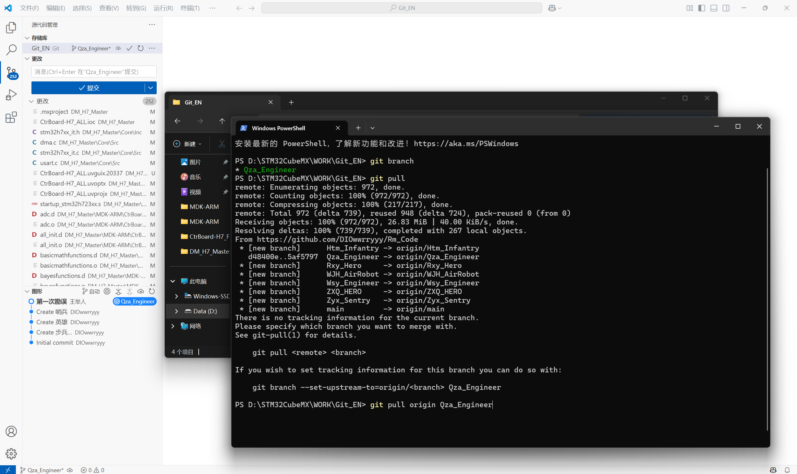
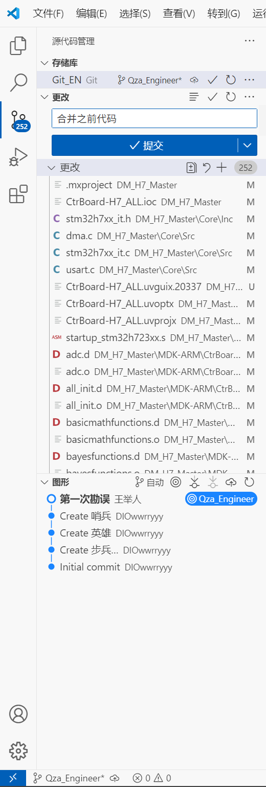
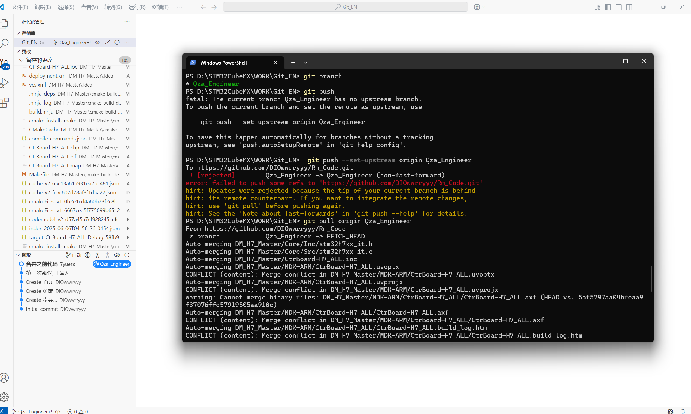
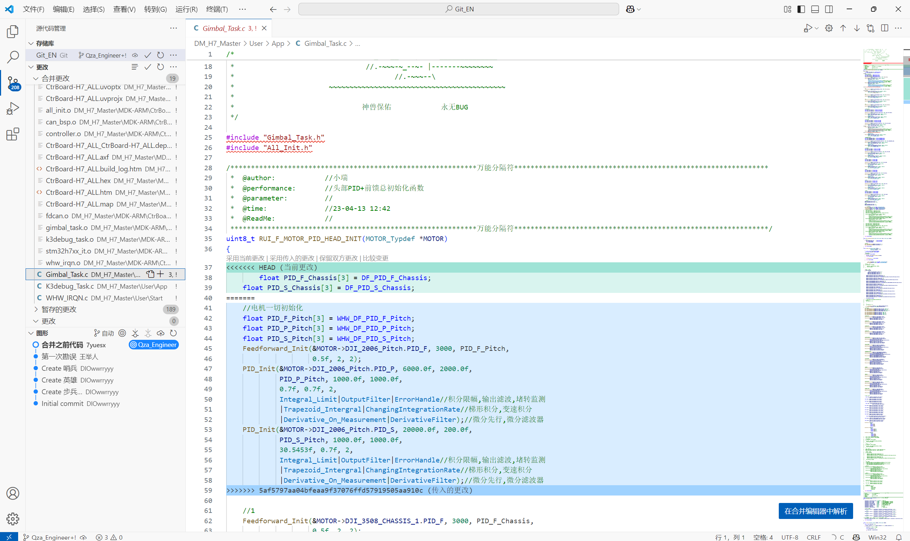
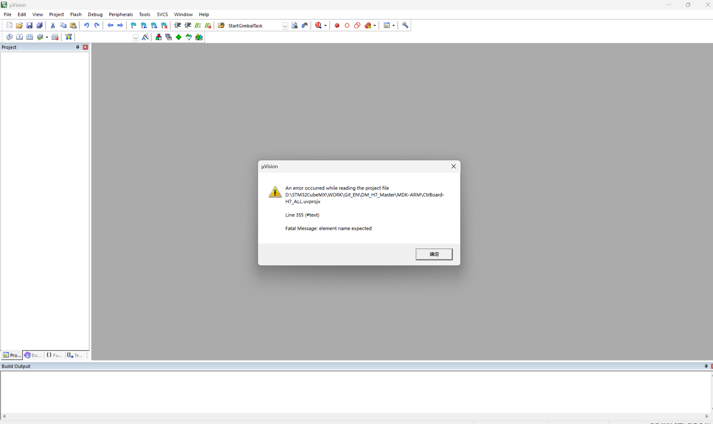

# Git 教程：将 main 分支更新合并到本地

本教程将介绍如何通过 Git 将 main 分支上的更新合并到本地工作分支中。我们提供两套方案：一套是基于常见工作流程及遇到问题的详细解决方案，另一套是最优化的操作步骤。

## 方案一：常见流程及问题解决

以下是一个实际工作中遇到的流程，包括可能出现的问题及解决方法：

### 1. 远程仓库上创建 PR 请求，merge 完成

* **操作说明**：在 GitHub/GitLab 等平台上，已经完成了 Pull Request 的创建和合并操作
* **实际影响**：远程的 main 分支已更新，但本地代码尚未同步这些更改


### 2. 检查当前分支

```bash
git branch
```

* **命令解释**：显示本地所有分支，当前分支前会有 `*` 标记
* **目的**：确认我们当前位于哪个分支，确保后续操作在正确的分支上进行

### 3. 尝试更新本地代码

```bash
git pull
```

* **命令解释**：从远程仓库拉取当前分支的最新代码并自动合并
* **等同于**：`git fetch` + `git merge origin/<current_branch>`

或者更明确地指定分支：

```bash
git pull origin <current_branch_name>
```



* **命令解释**：从远程仓库的指定分支拉取最新代码并合并到当前分支
* **问题**：这两个命令在当前场景中有重复操作，通常只需使用第一条命令即可

### 4. VSCode Git 扫描当前工作区，尝试提交代码出现报错

* **问题描述**：VSCode Git 界面显示错误信息
* **可能原因**：
  - 本地有未提交的更改，与远程更新产生冲突
  - 本地和远程分支已经分叉（diverged）




> 下面 5 可以不看，他是一个提交过程中的一次报错。

### 5. 尝试推送本地更改

```bash
git push
```

* **命令解释**：推送当前分支的更改到远程仓库
* **报错原因**：本地分支没有跟踪远程分支或已经落后于远程分支

尝试设置上游分支：

```bash
git push --set-upstream origin <current_branch_name>
```

* **命令解释**：将本地分支推送到远程并设置跟踪关系
* **报错信息**：`because the tip of your current branch is behind its remote counterpart.`
* **错误原因**：本地分支版本落后于远程分支，无法直接推送

### 6. 再次尝试拉取远程更新

```bash
git pull origin <current_branch_name>
```




* **命令解释**：强制从指定远程分支拉取并合并到本地
* **结果**：由于本地有修改且远程也有更新，进入合并冲突解决模式

### 7. 处理合并冲突

* **VSCode 界面操作**：
  - 打开有冲突的文件，会看到类似如下标记的冲突区域：

```
<<<<<<< HEAD
本地代码
=======
远程代码
>>>>>>> origin/branch_name
```
  
  - 对每个冲突选择：
    * **采用当前更改**：保留本地修改
    * **采用传入更改**：使用远程版本
    * **保留双方更改**：两者都保留
  - 完成选择后按 `Ctrl+S` 保存文件
  - 暂存已解决的文件（通过 Git 面板中的 "+" 号或 `git add` 命令）

* **注意事项**：
  - 解决每一处冲突后必须保存文件
  - 所有冲突解决完毕后，需要完成合并提交




### 8. 处理特殊文件冲突

* **特殊情况**：Keil MDK 项目文件（*.uvprojx）等二进制或特殊格式文件冲突
* **解决方法**：
  - 方法1：找到上一个可用版本替换当前文件
  - 方法2：在合并冲突时专门为这些文件选择"保留上次更改"
  - 方法3：通过命令行指定使用某一版本：

```bash
git checkout --ours -- path/to/file.uvprojx   # 保留自己的版本
git checkout --theirs -- path/to/file.uvprojx  # 使用远程版本
```




### 9. 完成合并

所有冲突解决后：

编译完成，检查无误后提交即可。 下面暂时不要看，还未测试。


```bash
git add .
git commit -m "合并 main 分支更新"
git push
```

* **命令解释**：
  - `git add .` - 暂存所有更改，包括解决的冲突
  - `git commit -m "..."` - 创建合并提交
  - `git push` - 推送合并后的代码到远程仓库

### 优化建议

1. **在拉取远程更新前，先提交或暂存本地更改**：
   ```bash
   git add .                       # 暂存所有更改
   git commit -m "本地修改的描述"  # 提交本地更改
   ```
   * **说明**：确保本地工作被保存，避免在合并时丢失

2. **使用 stash 暂时保存本地未提交的更改**：
```bash
git stash                # 暂存当前更改
git pull                 # 拉取远程更新
git stash pop            # 恢复之前的更改（可能需要解决冲突）
```
   * **说明**：适用于不想立即提交但又需要先更新代码的情况

3. **为特殊文件设置 .gitattributes**：
```
*.uvprojx merge=binary  # 将特定文件视为二进制文件处理
# 或
*.uvprojx merge=ours    # 合并时自动保留自己的版本
```
   * **说明**：避免每次都要手动处理特殊文件冲突

## 方案二：最优化合并流程（下面不要看，还未测试）

下面是拉取 main 分支更新到本地工作分支的最优流程：

### 1. 确保本地工作已保存

```bash
git status
```

* **命令解释**：显示工作区状态，包括已修改但未提交的文件
* **目的**：了解当前修改情况，决定如何处理这些更改

如有未提交的更改，可以选择提交或暂存：

```bash
# 提交更改
git add .                       # 暂存所有更改
git commit -m "本地修改描述"    # 提交更改

# 或者暂时保存更改
git stash save "进行中的工作"   # 保存当前更改并添加描述
```

* **命令解释**：
  - `git add .` - 将所有修改添加到暂存区
  - `git commit` - 创建一个新的提交，记录当前项目状态
  - `git stash save` - 临时保存修改，不创建提交

### 2. 确认并切换到目标分支

```bash
git branch                  # 查看所有本地分支
git checkout <branch_name>  # 切换到需要更新的分支
```

* **命令解释**：
  - `git branch` - 列出所有本地分支，当前分支有 `*` 标记
  - `git checkout` - 切换到指定分支

### 3. 拉取远程最新状态

```bash
git fetch --all
```

* **命令解释**：从远程仓库获取所有分支的最新状态，但不合并任何更改
* **目的**：了解远程仓库的最新状态，为后续操作做准备

### 4. 合并 main 分支更新

```bash
git merge origin/main
```

* **命令解释**：将远程 main 分支的更改合并到当前分支
* **可能结果**：
  - 自动合并成功：Git 自动处理所有更改
  - 发生冲突：需要手动解决冲突

### 5. 解决可能的合并冲突

如果出现冲突，需要手动解决：

* **命令行查看冲突文件**：
  ```bash
  git status  # 查看哪些文件有冲突
  ```

* **手动编辑冲突文件**：
  - 查找标有 `<<<<<<<`, `=======`, `>>>>>>>` 的地方
  - 编辑文件保留需要的代码
  - 删除冲突标记

* **或使用 VSCode 解决冲突**：
  - 打开冲突文件
  - 点击 "Accept Current Change"/"Accept Incoming Change"/"Accept Both Changes"
  - 保存文件

### 6. 标记冲突已解决

```bash
git add <conflicted_file>  # 标记单个文件冲突已解决
# 或
git add .                  # 标记所有冲突已解决
```

* **命令解释**：将修改后的文件添加到暂存区，表示冲突已解决

### 7. 完成合并

```bash
git commit                 # 如果是合并操作，会自动生成合并信息
# 或自定义提交信息
git commit -m "合并 main 分支的更新"
```

* **命令解释**：创建一个合并提交，完成分支合并过程

### 8. 推送更改到远程

```bash
git push
```

* **命令解释**：将本地更改推送到远程仓库
* **注意**：如果本地分支没有设置跟踪关系，可能需要：
  ```bash
  git push --set-upstream origin <branch_name>
  ```

### 9. 恢复之前暂存的工作（如果使用了 stash）

```bash
git stash list             # 查看所有暂存的工作
git stash pop              # 恢复最近一次暂存的工作
# 或
git stash apply stash@{n}  # 恢复特定的暂存工作但不删除 stash
```

* **命令解释**：
  - `git stash list` - 查看所有保存的工作进度
  - `git stash pop` - 恢复最新保存的工作并从 stash 列表中删除
  - `git stash apply` - 恢复指定的工作但保留在 stash 列表中

## 特殊文件处理建议

### 配置 .gitignore 忽略编译生成文件

在项目根目录创建或编辑 `.gitignore` 文件，添加以下内容：

```
# 编译生成文件
*.o
*.d
*.axf
*.hex
*.bin
*.lst
*.map
*.bak
*.dep
*.lnp
*.iex
*.htm
*.build_log.htm
*.lnk

# IDE生成的临时文件
.vscode/
*.uvguix.*
*.scvd
JLinkLog.txt
*.dbgconf
```

### 为特殊文件设置合并策略

在项目根目录创建或编辑 `.gitattributes` 文件：

```
# Keil项目文件使用自己的版本
*.uvprojx merge=ours
*.uvoptx merge=ours

# 或者将其视为二进制文件
# *.uvprojx binary
```

* **说明**：这会在自动合并时使用指定的策略，减少冲突处理

### 在冲突时手动选择特定版本

如果已经出现冲突，可以通过命令行强制选择某个版本：

```bash
# 保留自己的版本
git checkout --ours -- path/to/file.uvprojx

# 使用远程仓库的版本
git checkout --theirs -- path/to/file.uvprojx
```

* **命令解释**：
  - `--ours` - 选择当前分支（你的工作分支）的版本
  - `--theirs` - 选择要合并的分支（main 分支）的版本

## 总结

**正确的工作流程核心步骤**：

1. 保存当前工作（commit 或 stash）

2. 获取远程更新（fetch）

3. 合并更新到本地分支（merge）

4. 解决冲突（如果有）

5. 完成合并提交（commit）

6. 推送合并后的更改（push）

通过遵循这些步骤，可以有效避免大多数合并问题和数据丢失的风险。特别是对于特殊文件（如 Keil 项目文件），合理配置 Git 可以大大减少处理冲突的工作量。